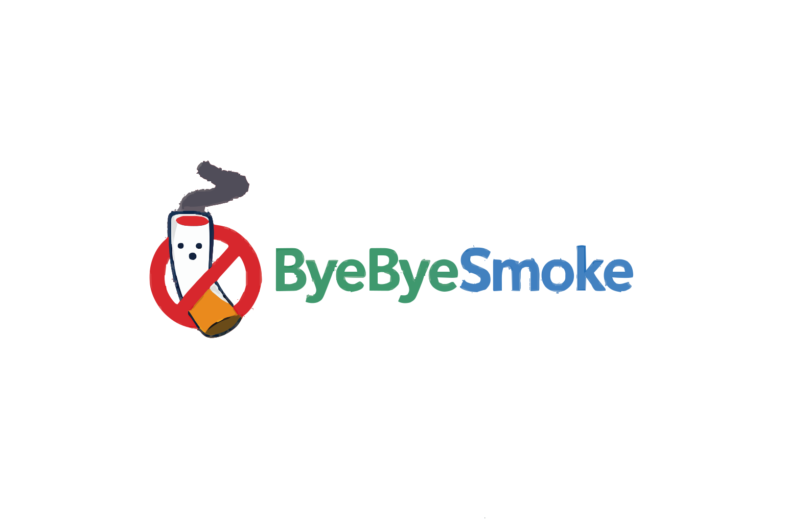

  

<h1 align="center">ByeByeSmoke</h1>

  <strong>Dein digitaler Begleiter für ein rauchfreies Leben</strong>

  <a href="https://byebyesmoke.de">byebyesmoke.de</a>

---

## Komplett kostenlos

ByeByeSmoke ist **100% kostenlos** - ohne Wenn und Aber:

- Keine In-App-Käufe
- Keine Werbung
- Keine Premium-Version
- Keine versteckten Kosten
- Alle Features für jeden verfügbar

---

## Features

### Fortschritt & Statistiken
- **Live-Tracking** - Rauchfreie Tage, gespartes Geld, vermiedene Zigaretten
- **Visuelle Fortschrittsanzeige** - Wachsender Baum, Sparschwein, Zigaretten-Friedhof
- **Health Score** - Wissenschaftlich fundierter Gesundheitsindex (0-100)
- **Detaillierte Stats** - Lungengesundheit, gewonnene Lebenszeit, Umwelt-Impact

### Gesundheit & Motivation
- **28 Gesundheitsmeilensteine** - Von 20 Minuten bis 20 Jahren
- **Health Avatar** - Animierte Visualisierung der Körper-Regeneration
- **"Was passiert JETZT"** - Zeigt aktuelle Regenerationsphase live
- **Täglich wechselnde Motivation**

### SOS & Hilfe
- **Craving-Timer** - 5-Minuten-Timer mit geführten Atemübungen
- **Verlangen-Statistik** - Tracking mit Kalender-Heatmap
- **Tipps gegen Verlangen** - Praktische Strategien
- **Mini-Games** - Ablenkung bei akutem Verlangen

### Weitere Features
- **Achievements** - Erfolge freischalten
- **Push-Benachrichtigungen** - Bei Meilensteinen (optional)
- **Datenexport** - DSGVO-konform (JSON)
- **Dark Mode**
- **Offline-fähig** - Funktioniert auch ohne Internet
- **Installierbar** - Als App auf dem Smartphone (PWA)

---

## Datenschutz

- **DSGVO-konform** - Datenminimierung, Transparenz
- **Datenexport** - Alle deine Daten als JSON exportieren
- **Account-Löschung** - Jederzeit vollständig möglich
- **Keine Tracking-Cookies** - Keine Werbung, kein Analytics

Mehr dazu: [Datenschutzerklärung](https://byebyesmoke.de/app/datenschutz.html)

---

## Browser-Support

- Chrome/Edge (empfohlen)
- Firefox
- Safari (iOS & macOS)

Funktioniert auf allen modernen Browsern mit ES6-Module-Support.

---

## Für Entwickler

Technische Dokumentation für Entwickler und Self-Hosting:

- [Entwickler-Dokumentation](docs/DEVELOPMENT.md) - Tech Stack, Architektur, Tests
- [Self-Hosting Anleitung](docs/SELF-HOSTING.md) - Eigene Instanz betreiben
- [Sicherheit](docs/SECURITY.md) - Implementierte Sicherheitsmassnahmen

---

## Lizenz

Dieses Projekt ist nicht zur freien Verwendung lizenziert.

---

## Kontakt

**Verantwortlicher:** Hamied Nabizada
**Website:** [byebyesmoke.de](https://byebyesmoke.de)
**Impressum:** [byebyesmoke.de/app/impressum.html](https://byebyesmoke.de/app/impressum.html)
